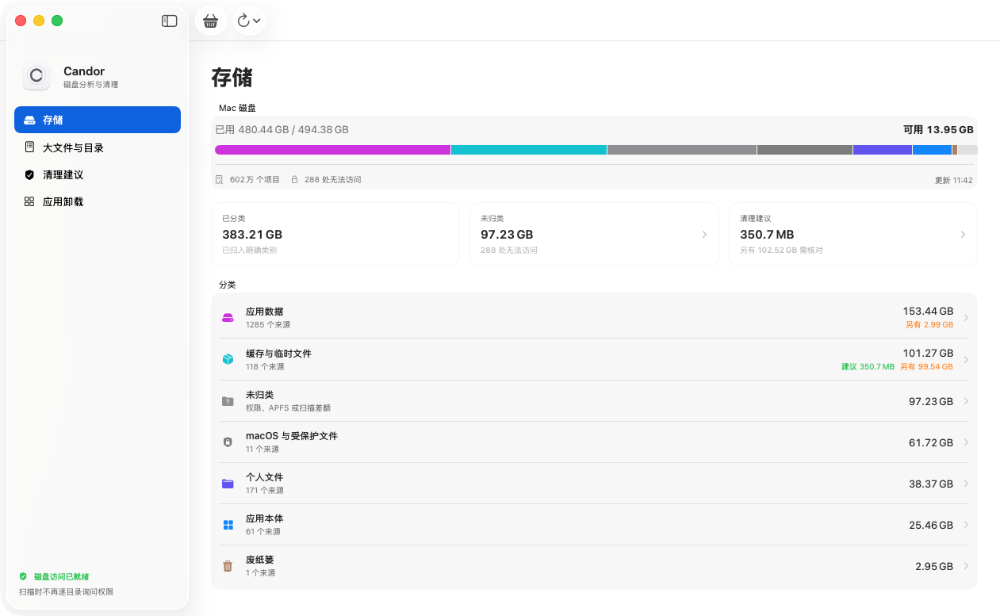
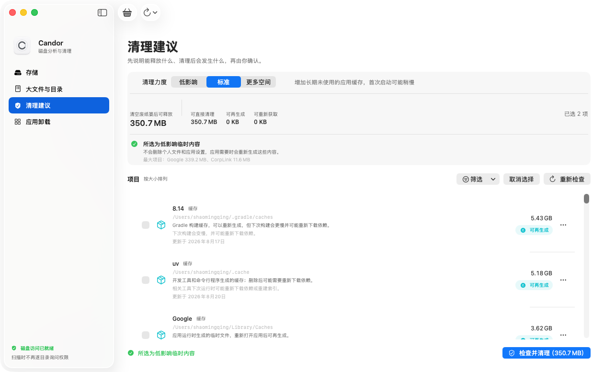
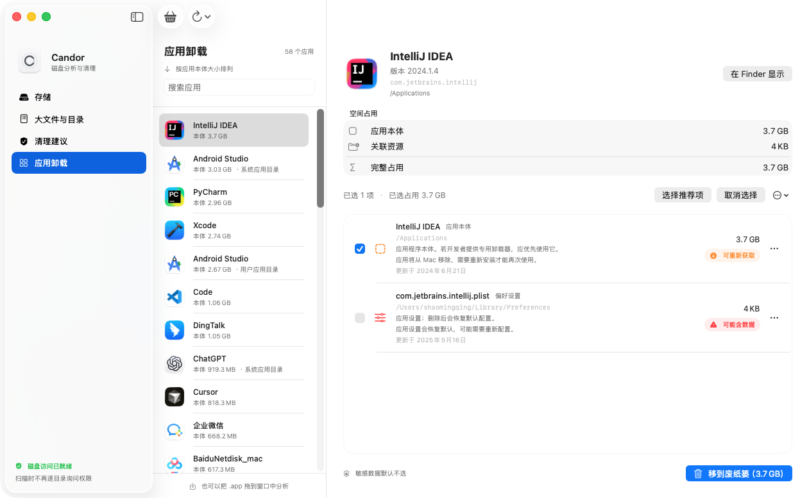

<p align="center">
  
</p>

<h1 align="center">Candor</h1>

<p align="center">
  看清磁盘空间，放心清理。
</p>

<p align="center">
  
  
  
  
  <a href="https://github.com/shaominngqing/Candor/actions/workflows/build-release.yml"></a>
</p>

Candor 是一款原生 macOS 磁盘分析、空间清理与应用卸载工具。它不把“系统数据”包装成一个吓人的垃圾数字，而是说明空间被什么占用、文件在哪里、能否清理，以及清理后会发生什么。

Candor is a native SwiftUI disk space analyzer, safe cleanup tool, and complete app uninstaller for macOS.

> **每一 GB 都有归属，每一次清理都有依据。**



## 为什么做 Candor

把应用拖进废纸篓，缓存、设置和支持文件可能仍留在 Mac 中；当磁盘空间不足时，macOS 的“系统数据”又很难解释，用户既找不到真正的大目录，也不敢进入 `~/Library` 随意删除。

Candor 用一份可核对的空间账本解决这个问题：

```text
已使用空间 = 已分类空间 + 未归类空间
```

“清理建议”是已分类空间中的可处理子集，不会与磁盘占用重复相加；尚未扫描、没有权限或无法可靠归因的内容会保留为“未归类”，不会被冒充为可清理垃圾。

## 核心能力

| 模块 | 解决的问题 |
| --- | --- |
| **存储** | 对账磁盘总量，解释应用、个人文件、缓存、系统文件与未归类空间各占多少。 |
| **大文件与目录** | 按实际占用从大到小查找文件和聚合目录，逐层进入，不必一次渲染整棵文件树。 |
| **清理建议** | 按影响分级生成可清理候选，说明来源、路径、容量和删除后的影响。 |
| **应用卸载** | 合并计算应用本体与关联资源，默认保护偏好设置、数据库等可能含数据的内容。 |

### 大文件与目录

目录与文件统一按占用排序。Candor 首次扫描时建立目录大小索引，打开文件夹后优先复用已有结果；只有索引缺失的局部目录才补充计算。


### 分级清理建议

Candor 不用一个含糊的“深度清理”按钮制造压力，而是把范围和影响拆开说明：

| 清理范围 | 默认包含 |
| --- | --- |
| **低影响** | 旧日志、临时状态等低影响内容。 |
| **标准** | 增加长期未使用的应用缓存，应用首次启动可能稍慢。 |
| **更多空间** | 增加大型可重建缓存和可重新获取的资源。 |

可能包含个人数据、设置或数据库的项目永远不会自动选择。用户可以继续按类型和影响筛选、逐项调整，或永久排除不希望再次推荐的路径。



### 完整应用卸载

应用列表按本体大小排序。选择或拖入一个 `.app` 后，Candor 会列出应用本体以及能确认来源的缓存、偏好设置、支持文件和其他关联资源，并合并展示完整占用。



## 安全原则

- **只移到废纸篓**：不永久删除，也不自动清空废纸篓；清空前仍可恢复。
- **默认保守**：可能含数据的项目默认不选，清理前再次展示总容量和主要项目。
- **保护系统范围**：macOS 系统目录和共享系统资源只读展示，不提供直接删除。
- **路径可验证**：每个候选都显示实际路径、归类依据和清理影响，不执行不透明脚本。
- **完全本地**：只读取文件名、路径、大小和日期等元数据；扫描结果不会上传。
- **授权透明**：完全磁盘访问权限只能由用户在系统设置中开启，Candor 不尝试绕过 macOS 保护。

## 扫描与性能

- 首次递归扫描建立来源级空间账本和目录大小索引。
- 后续“快速更新”优先复用未变化的来源，只重新计算发生变化或已经过期的目录。
- 扫描过程中保存检查点，中断后可以继续，而不是从零开始。
- 存储、大文件、清理建议和应用大小共享同一份扫描结果，尽量避免重复遍历。
- 首次扫描未完成时显示“正在分析”而不是 `0 KB`；后台更新时继续展示上一次结果。
- 清理范围切换只更新选择快照，不重新扫描磁盘。

## 权限说明

为了统计邮件、浏览器、应用容器等受保护目录，建议首次启动时开启：

```text
系统设置 → 隐私与安全性 → 完全磁盘访问权限 → Candor
```

也可以选择有限扫描。有限模式会主动跳过受保护目录，相应容量进入“未归类”，扫描过程中不会逐个目录弹出权限请求。

## 下载与安装

[下载最新版 Candor](https://github.com/shaominngqing/Candor/releases/latest)

1. 根据 Mac 芯片下载对应的 `.dmg`：`arm64` 用于 Apple Silicon，`x86_64` 用于 Intel。
2. 双击 DMG，按照窗口中的箭头把 `Candor` 拖到右侧“应用程序”。
3. 推出磁盘镜像，然后从“应用程序”打开 Candor。

ZIP 作为不需要挂载磁盘镜像的备用下载保留；每个 DMG 和 ZIP 都提供 SHA-256 校验文件。

从 `0.14.0` 起，Candor 会每天自动检查一次稳定版更新。也可以随时从“Candor”菜单选择“检查软件更新…”。更新包通过 Ed25519 签名验证，确认后由应用完成替换并重新打开；自动检查和自动下载可以在系统“设置”窗口中分别关闭。

当前公开版本使用临时签名，尚未经过 Apple Developer ID 公证。若 macOS 首次打开时提示无法验证开发者，请在 Finder 中按住 Control 点击 Candor，选择“打开”，再确认一次；无需也不建议关闭 Gatekeeper。正式免提示分发仍需完成签名、公证和 stapling。

## 本地运行

运行要求：macOS 13 或更高版本。为确保 SwiftUI 使用与产品截图一致的原生样式，正式发布包统一使用 Xcode 26.6 和 macOS 26 SDK 构建。

```bash
git clone git@github.com:shaominngqing/Candor.git
cd Candor
swift run Candor
```

生成可以双击运行的应用包：

```bash
./Scripts/build-app.sh
open "dist/Candor.app"
```

为当前 Mac 生成 DMG 和备用 ZIP：

```bash
./Scripts/package-release.sh "$(uname -m)"
```

为 GitHub Release 生成当前架构的签名更新源：

```bash
./Scripts/generate-appcast.sh "$(uname -m)" "v0.14.0"
```

更新私钥保存在 macOS 钥匙串和 GitHub Actions Secret 中，不应提交到仓库。

运行测试：

```bash
swift test
```

构建脚本目前使用临时签名，适合本机开发测试。正式分发仍需要 Developer ID、Hardened Runtime、公证与 stapling。

## 项目结构

```text
Sources/Candor/
├── Models/       数据模型与风险等级
├── Services/     磁盘扫描、账本缓存、文件匹配与安全删除
├── ViewModels/   全局状态、增量更新与选择管理
└── Views/        原生 SwiftUI 界面

Tests/CandorTests/  路径安全、分类、扫描复用与性能测试
AppResources/       应用图标、Info.plist、隐私清单与第三方许可
Docs/images/        README 使用的产品截图
```

## 当前状态

Candor 目前处于 **0.14.0 公开测试阶段**。核心扫描、空间对账、分级建议、应用关联分析、废纸篓删除和应用内更新流程已经可用，但仍应在重要数据已有备份的环境中测试。

已知边界：

- APFS 克隆、快照、共享数据与可清除空间可能导致目录合计和物理占用存在差异。
- 有限扫描无法读取的内容只会计入“未归类”，不会猜测具体用途。
- SDK、虚拟机、本地模型等大型资源通常更适合按完整组件处理，部分内容会引导回来源工具管理。
- 当前不提供永久粉碎、自动清空废纸篓、关闭 SIP 或修改系统保护范围的功能。

版本变化见 [CHANGELOG.md](CHANGELOG.md)。
